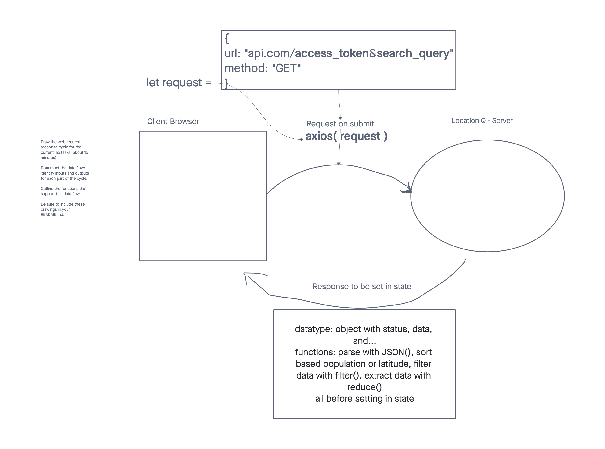

# Project Name: City Explorer

**Author**: Jacob Bassett
**Version**: 1.0.0 

## Overview

This is an app that users can search for location based directions, amenities, weather, and other pertinent information.

## Getting Started
<!-- What are the steps that a user must take in order to build this app on their own machine and get it running? --> 
I will update this when I am closer to finishing the build.

## Architecture
<!-- Provide a detailed description of the application design. What technologies (languages, libraries, etc) you're using, and any other relevant design information. -->
I will update this when I am closer to finishing the build.

## Change Log
<!-- Use this area to document the iterative changes made to your application as each feature is successfully implemented. Use time stamps. Here's an example:

01-01-2001 4:59pm - Application now has a fully-functional express server, with a GET route for the location resource. -->
I will update this before the end of today.

## Credit and Collaborations
<!-- Give credit (and a link) to other people or resources that helped you build this application. -->
Collaborators: Kawika Miller
Creater: Jacob Bassett

## Wireframes

Request and Response Cycle

## Progress Log

I will use this section to track my performance. I will be recording features and measuring how long they took me to implement. 

Feature Name: Build a form to accept user input and display location name, longitude and latitude.
Estimate for development: 1.5 hrs
Start: 17:45
End: 20:00
Actual: 2:45

Feature Name: Display static image and style elements with CSS and Bootstrap
Estimate for development: 2hr
Start: 20:00
End:
Actual: 

Feature Name:
Estimate for development:
Start:
End:
Actual: 

Feature Name:
Estimate for development:
Start:
End:
Actual: 

Feature Name:
Estimate for development:
Start:
End:
Actual: 

Feature Name:
Estimate for development:
Start:
End:
Actual: 